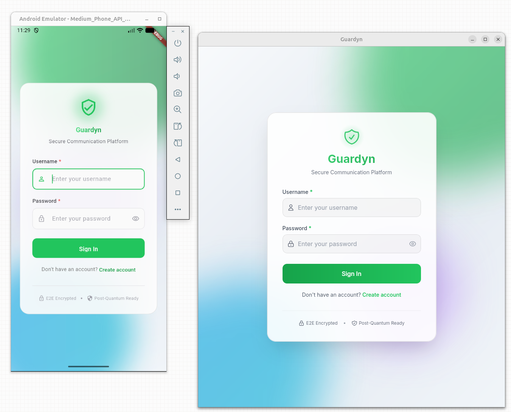

<p align="center">
  
</p>

<h1 align="center">Guardyn: Privacy-Focused Secure Communication</h1>

<p align="center">
  <strong>Open source messaging platform built on proven cryptography (Signal Protocol + OpenMLS)</strong>
</p>

<p align="center">
  <a href="#-current-status"><strong>Project Status</strong></a> •
  <a href="#-technical-approach"><strong>Architecture</strong></a> •
  <a href="#-getting-started"><strong>Get Started</strong></a> •
  <a href="docs/DEVELOPER_QUICKSTART.md"><strong>Developer Guide</strong></a> •
  <a href="docs/IMPLEMENTATION_PLAN.md"><strong>Documentation</strong></a> •
  <a href="CONTRIBUTING.md"><strong>Contributing</strong></a>
</p>

<p align="center">
  
  
  
  
  
</p>

---

## 🚀 Current Status

**Phase:** Production-Ready — v1.0 Launch (January 2026)

**What's Deployed:**

- ✅ **Backend Services**: Auth, Messaging, Presence, Media, Call, Notification services (Kubernetes)
- ✅ **Cryptography**: PQXDH (ML-KEM hybrid), Double Ratchet, OpenMLS, SFrame, Sealed Sender
- ✅ **Infrastructure**: Production-ready stack (TiKV, ScyllaDB, Redpanda, Envoy)
- ✅ **Observability**: Prometheus SLOs, Loki log aggregation, Tempo tracing, Grafana dashboards
- ✅ **Mobile Client**: Flutter (iOS/Android) with full feature set
- ✅ **Desktop Client**: Tauri (Linux, macOS, Windows) with native UX
- ✅ **Voice/Video Calls**: WebRTC + SFrame E2EE (1-on-1)
- ✅ **Security**: Rate limiting, Sealed Sender, hardware key storage
- ✅ **Testing**: E2E integration tests, performance benchmarks, penetration testing

**Architecture:**

```
┌─────────────────────────────────────────────────────────────────────────────┐
│                           GUARDYN ARCHITECTURE                               │
├─────────────────────────────────────────────────────────────────────────────┤
│                                                                              │
│  ┌──────────────┐     ┌──────────────┐                                      │
│  │   Flutter    │     │    Tauri     │                                      │
│  │ (iOS/Android)│     │(Win/Mac/Linux)│                                     │
│  └──────┬───────┘     └──────┬───────┘                                      │
│         │                    │                                              │
│         └────────┬───────────┘                                              │
│                  ▼                                                          │
│  ┌───────────────────────────────────┐                                      │
│  │      guardyn-crypto (Rust)        │ ◄── Single source of truth          │
│  │  ├── PQXDH (X3DH + ML-KEM)        │     for all cryptography             │
│  │  ├── Double Ratchet               │                                      │
│  │  ├── MLS (AES-256-GCM)            │                                      │
│  │  ├── SFrame (voice/video)         │                                      │
│  │  └── Sealed Sender                │                                      │
│  └───────────────────────────────────┘                                      │
│                  │                                                          │
│              gRPC (native on all platforms)                                 │
│                  ▼                                                          │
│         ┌──────────────────────────────────────┐                            │
│         │  Backend Services (Rust)              │                            │
│         │  ├── Auth Service (+ Sealed Sender)   │                            │
│         │  ├── Messaging Service                │                            │
│         │  ├── Presence Service                 │                            │
│         │  ├── Media Service                    │                            │
│         │  ├── Notification Service (FCM/APNs)  │                            │
│         │  └── Call Service (WebRTC SFU)        │                            │
│         └──────────────┬───────────────────────┘                            │
│                        │                                                     │
│         ┌──────────────┼─────────────────────────┐                          │
│         ▼              ▼                         ▼                          │
│  ┌──────────────┐   ┌──────────────┐   ┌──────────────┐                    │
│  │    TiKV      │   │  ScyllaDB    │   │   Redpanda   │                    │
│  │              │   │              │   │(Kafka-compat)│                    │
│  └──────────────┘   └──────────────┘   └──────────────┘                    │
│                                                                              │
└─────────────────────────────────────────────────────────────────────────────┘
```

**Pending:**

- 📋 External security audit (Cure53)
- 📋 Group calls (LiveKit SFU)
- 📋 App Store and Play Store final submission

[Full technical roadmap →](docs/IMPLEMENTATION_PLAN.md)

---

## 🎯 Project Vision

Guardyn aims to provide enterprise-grade secure communication with the same privacy guarantees as Signal, while adding:

- **Self-hosting capability** for organizations requiring data sovereignty
- **Modern group encryption** using OpenMLS (IETF standard RFC 9420)
- **Full transparency** with 100% Apache-2.0 licensed code and reproducible builds
- **Enterprise features** (planned: LDAP, SAML, compliance tools)

**We build on Signal's foundation**, not against it. Signal pioneered the Double Ratchet protocol, and we use the same battle-tested cryptography for 1-on-1 messaging. For groups, we implement OpenMLS—the newer IETF standard designed specifically for scalable group encryption.

---

## 📱 Cross-Platform Applications

<p align="center">
  
</p>

<p align="center">
  <em>Guardyn running on Android, iOS, Linux, macOS — same encryption everywhere via native Rust FFI</em>
</p>

> **Security Note**: Web platform (Chrome/Firefox) has been intentionally removed.
> All platforms use native Rust FFI via guardyn-crypto library for post-quantum cryptography.
> This eliminates JavaScript crypto vulnerabilities and ensures consistent security across all clients.

---

## 🔐 Why Guardyn?

### The Problem We're Solving

Modern messaging platforms face a fundamental tension:

- **Privacy-first apps** (like Signal) struggle with enterprise adoption and sustainable funding
- **Enterprise platforms** (like Slack, Teams) lack end-to-end encryption and are closed source
- **Popular messengers** (like Telegram, WhatsApp) make privacy compromises for scale

### Our Approach

**For individuals and privacy advocates:**

- Military-grade encryption (Signal Protocol + OpenMLS)
- Zero-knowledge architecture (servers can't decrypt your messages)
- Open source and auditable (Apache-2.0 license)
- Self-hosting option (full control of your data)

**For organizations:**

- Compliance-ready architecture (GDPR, HIPAA, SOC 2 target)
- Self-hosted deployment option (data sovereignty)
- Enterprise features (planned: SSO, admin tools, audit logs)
- Kubernetes-native scalability

**For high-security environments:**

- Government agencies requiring secure inter-agency communication
- Military organizations needing tactical and strategic messaging
- Intelligence services with strict data sovereignty requirements
- Defense contractors handling classified information
- Security-conscious institutions with air-gap deployment needs
- Zero-trust architecture (even we can't decrypt your data)

**For developers:**

- 100% open source (no proprietary server components)
- Reproducible builds (verify binaries match source)
- Modern tech stack (Rust, Kubernetes, gRPC)
- Formal verification (TLA+ specs, cryptographic proofs planned)

---

## 🔍 Comparison: How Guardyn Differs

### Design Philosophy

**Signal Foundation pioneered modern E2EE messaging**. The Double Ratchet protocol they created is now the industry standard, protecting billions of messages daily. We build on their work, not against it.

**Guardyn's additions:**

- OpenMLS for scalable group encryption (IETF RFC 9420)
- Self-hosting option for data sovereignty
- Enterprise features (LDAP, SAML, audit logs - planned)
- 100% open source server components (Apache-2.0)

### Technical Comparison

#### vs. Signal (Our Foundation)

| Feature             | Signal                              | Guardyn v1.0 (2026)                              | Notes                          |
| ------------------- | ----------------------------------- | ------------------------------------------------ | ------------------------------ |
| 1-on-1 E2EE         | ✅ Double Ratchet                   | ✅ Double Ratchet (same protocol)                | Both use battle-tested Signal  |
| Group E2EE          | ✅ Sender Keys (proven, 2020)       | ✅ OpenMLS (IETF RFC 9420)                       | Different approaches, both E2E |
| Voice/Video E2EE    | ✅ SRTP + DTLS                      | ✅ WebRTC + SFrame                               | Both provide call encryption   |
| Post-Quantum        | 🚧 PQXDH in development             | ✅ PQXDH (X3DH + ML-KEM hybrid)                  | Guardyn has PQ implemented     |
| Sealed Sender       | ✅ Metadata protection              | ✅ Sealed Sender (Signal-compatible)             | Both protect sender metadata   |
| Server Open Source  | ⚠️ Most components open             | ✅ 100% open (Apache-2.0)                        | Full transparency              |
| Reproducible Builds | ⚠️ Android only                     | ✅ Nix flakes (all platforms)                    | Deterministic builds           |
| Self-Hosting        | ❌ Not supported                    | ✅ Full Kubernetes + Docker Compose              | Core difference                |
| Hardware Keys       | ⚠️ iOS Secure Enclave only          | ✅ TPM 2.0, Secure Enclave, KeyStore             | Multi-platform HW support      |
| Event Streaming     | ❌ Proprietary infrastructure       | ✅ Redpanda (Kafka-compatible)                   | Open source streaming          |
| Local Development   | ❌ Server not developer-friendly    | ✅ 30-second Docker Compose startup              | Developer experience           |
| Observability       | ⚠️ Internal only                    | ✅ Prometheus + Loki + Tempo + Grafana           | Production monitoring          |
| Enterprise Features | ❌ Consumer-focused                 | 🚧 LDAP, SAML (planned v1.2)                     | Different target market        |
| Track Record        | ✅ **10+ years, billions of users** | ⚠️ **v1.0 release (Jan 2026)**                   | Signal has proven reliability  |
| Security Audits     | ✅ **Multiple completed**           | 📋 **Planning Cure53 (Q2 2026)**                 | Signal is audit-proven         |
| Client Platforms    | ✅ iOS, Android, Desktop, Web       | ✅ iOS/Android (Flutter), Desktop (Tauri)        | Platform-optimized clients     |
| Unified Crypto      | ⚠️ Separate implementations         | ✅ Single guardyn-crypto Rust library (FFI/Tauri)| Single audit surface           |

**Verdict:** Signal has 10+ years of battle-testing and billions of users. Guardyn v1.0 (2026) adds self-hosting, unified cryptography, and developer-friendly infrastructure to proven protocols. If you need maximum trust, use Signal. If you need self-hosting or want to contribute to open source infrastructure, consider Guardyn once audited.

---

#### vs. WhatsApp (Signal Protocol + Meta)

| Feature          | WhatsApp                        | Guardyn v1.0 (2026)                          | Notes                                 |
| ---------------- | ------------------------------- | -------------------------------------------- | ------------------------------------- |
| E2EE Protocol    | ✅ Signal Protocol              | ✅ Signal + OpenMLS for groups               | Both use Signal for 1-on-1            |
| Voice/Video      | ✅ WebRTC E2EE                  | ✅ WebRTC + SFrame (1-on-1 implemented)      | Both provide call encryption          |
| Metadata Privacy | ❌ Collected by Meta            | ✅ Sealed Sender + minimal collection        | Major difference                      |
| Cloud Backups    | ⚠️ Unencrypted on iCloud/Google | ✅ Local only, encrypted (E2EE)              | WhatsApp has unencrypted backup issue |
| Open Source      | ❌ Closed source                | ✅ Full stack open (Apache-2.0)              | Auditability difference               |
| Client Strategy  | ⚠️ Single codebase (Electron)   | ✅ Flutter (mobile) + Tauri (desktop)        | Platform-optimized UX                 |
| Cryptography     | ⚠️ Multiple implementations     | ✅ Single guardyn-crypto library             | Unified audit surface                 |
| Business Model   | Meta advertising empire         | Open source (cloud SaaS planned)             | Fundamental difference                |
| Self-Hosting     | ❌ Not possible                 | ✅ Kubernetes + Docker Compose               | Data sovereignty option               |
| Infrastructure   | ❌ Proprietary Meta stack       | ✅ Open: Redpanda, TiKV, ScyllaDB            | Transparent infrastructure            |
| User Base        | ✅ **2+ billion users**         | ⚠️ **v1.0 release (Jan 2026)**               | WhatsApp is proven at scale           |

**Verdict:** WhatsApp uses Signal's E2EE but collects metadata for Meta's advertising. Guardyn focuses on both content and metadata privacy, with self-hosting and unified open source infrastructure. WhatsApp has massive scale advantage.

---

#### vs. Telegram (Convenience vs. Security)

| Feature            | Telegram                                   | Guardyn v1.0 (2026)                        | Notes                                 |
| ------------------ | ------------------------------------------ | ------------------------------------------ | ------------------------------------- |
| E2EE by Default    | ❌ Only "Secret Chats"                     | ✅ Always E2EE                             | **Critical security difference**      |
| Group E2EE         | ❌ Server can read messages                | ✅ OpenMLS (cryptographically protected)   | **Telegram groups are not E2EE**      |
| Voice/Video E2EE   | ❌ Not encrypted                           | ✅ WebRTC + SFrame (1-on-1 implemented)    | Guardyn prioritizes security          |
| Sealed Sender      | ❌ Server sees all metadata                | ✅ Metadata protection implemented         | Privacy difference                    |
| Server Open Source | ❌ Closed                                  | ✅ Apache-2.0 (100% transparent)           | Full transparency                     |
| Crypto Review      | ⚠️ MTProto (custom, criticized by experts) | ✅ Standard protocols (Signal, OpenMLS)    | Telegram's crypto is non-standard     |
| Unified Crypto     | ⚠️ Multiple implementations                | ✅ Single guardyn-crypto Rust library      | Single audit surface                  |
| Cloud Sync         | ✅ Convenient (server stores plaintext)    | ❌ Local only (privacy over convenience)   | Different priorities                  |
| Infrastructure     | ❌ Proprietary stack                       | ✅ Open: Redpanda, TiKV, ScyllaDB          | Transparent infrastructure            |
| Self-Hosting       | ❌ Not supported                           | ✅ Kubernetes + Docker Compose             | Data sovereignty                      |
| User Base          | ✅ **900+ million users**                  | ⚠️ **v1.0 release (Jan 2026)**             | Telegram has massive user base        |
| Independent Audits | ⚠️ Limited, MTProto not widely reviewed    | 📋 Planning (Cure53 Q2 2026)               | Both need more independent validation |

**Verdict:** Telegram prioritizes convenience and cloud sync over E2EE. Most Telegram conversations are readable by servers. Guardyn enforces E2EE always (Signal Protocol + OpenMLS), sacrificing some convenience for security and providing self-hosting option.

---

#### vs. Viber (Consumer Messaging)

| Feature         | Viber                      | Guardyn v1.0 (2026)                    | Notes                              |
| --------------- | -------------------------- | -------------------------------------- | ---------------------------------- |
| E2EE            | ⚠️ Optional, not default   | ✅ Mandatory, always on                | **Default security differs**       |
| Crypto Standard | ⚠️ Proprietary protocol    | ✅ Industry standards (Signal, MLS)    | Guardyn uses peer-reviewed crypto  |
| Voice/Video     | ⚠️ Optional encryption     | ✅ WebRTC + SFrame (mandatory E2EE)    | Guardyn enforces call encryption   |
| Security Audit  | ❌ None publicly available | 📋 Planning (Cure53 Q2 2026)           | Both need independent verification |
| Open Source     | ❌ Closed                  | ✅ Apache-2.0 (100% transparent)       | Transparency difference            |
| Self-Hosting    | ❌ Not supported           | ✅ Kubernetes + Docker Compose         | Data sovereignty option            |
| Unified Crypto  | ⚠️ Multiple implementations| ✅ Single guardyn-crypto library       | Single audit surface               |
| Business Model  | Ads, stickers, games       | Open source (cloud SaaS planned)       | Revenue model differs              |
| Target Market   | Consumer messaging         | Privacy-focused users, enterprises     | Different audiences                |

**Verdict:** Viber is a consumer messaging app with optional encryption. Guardyn is focused on mandatory E2EE (Signal Protocol + OpenMLS), open source transparency, and self-hosting capability for organizations requiring data sovereignty.

---

### Key Takeaways

1. **We respect Signal** - they pioneered the Double Ratchet protocol we use. Their 10 years of battle-testing is invaluable.
2. **Our additions** - OpenMLS for groups, self-hosting, enterprise features, 100% Apache-2.0 license
3. **We're new (2025)** - Signal has proven reliability at scale. Guardyn is unproven but building on proven protocols.
4. **Audit status** - Signal has completed multiple security audits. Guardyn is planning Cure53 audit for Q2 2026.
5. **Use Signal if** - you want maximum trust and proven reliability
6. **Consider Guardyn if** - you need self-hosting or want to contribute to open source development

---

## 📋 Technical Foundation

### Cryptographic Protocols

**1-on-1 Messaging (Implemented):**

- PQXDH key exchange (X3DH + ML-KEM hybrid for post-quantum resistance)
- Double Ratchet (Signal Protocol - same as WhatsApp, Signal)
- AES-256-GCM encryption (NIST standard)
- PADMÉ padding (traffic analysis protection)

**Group Messaging (Implemented):**

- OpenMLS (IETF RFC 9420 - 2024 standard)
- AES-256-GCM cipher suite (unified with Double Ratchet)
- Tree-based group management (scalable to 10k+ members)
- Post-compromise security (automatic healing)

**Voice/Video Calls (Implemented):**

- SFrame encryption for voice/video
- WebRTC with insertable streams
- P2P for 1-on-1 calls

**Metadata Protection (Implemented):**

- Sealed Sender protocol (hides sender identity from server)
- Hardware-backed key storage (iOS Secure Enclave, Android KeyStore)

### Infrastructure Stack

**Backend (Production-Ready):**

- Rust services (memory-safe, no buffer overflows)
- gRPC APIs (efficient binary protocol)
- TiKV distributed KV store (ACID transactions)
- ScyllaDB for message storage (high throughput)
- Redpanda (Kafka-compatible event streaming)

**Client Communication:**

- Native gRPC for all platforms (direct TCP connections)
- Platform-specific host resolution (Android: 10.0.2.2, Desktop: localhost)
- No browser/web support (security decision - no JavaScript crypto)

**Deployment (Production-Ready):**

- Kubernetes-native (Docker Compose for local dev, k8s for prod)
- Horizontal Pod Autoscaling with SLO-based alerting
- Pod Disruption Budgets for zero-downtime deployments
- cert-manager for TLS automation

**Observability (Production-Ready):**

- Prometheus metrics collection with SLO rules
- Grafana dashboards with SLO monitoring
- Loki log aggregation
- Distributed tracing (OpenTelemetry)

### Build Reproducibility

**Nix Flakes (Implemented):**

- Deterministic builds across all platforms
- Pinned dependencies (nixpkgs 23.11)
- Same binary from same source code
- SBOM generation with Syft
- Artifact signing with Cosign

### Performance Benchmarks (Current)

### Performance Benchmarks (Current)

**E2E Test Results (November 2025):**

- Auth Service: 361ms P95 latency (local k3d cluster)
- Messaging Service: 28ms P95 latency (local k3d cluster)
- 8/8 integration tests passing
- k6 performance baseline established

**Note:** These are local development benchmarks, not production performance guarantees. Production benchmarks will be published after cloud deployment.

---

## 🚀 Getting Started

### Current Status (November 2025)

**What's Working:**

**Production-Ready Backend:**

- **Authentication Service**: User registration, login, JWT auth, device management, Sealed Sender
- **Messaging Service**: 1-on-1 and group chat, reactions, replies, edit/delete, voice messages
- **Presence Service**: Online/offline status, typing indicators
- **Media Service**: File uploads, encryption, thumbnails
- **Call Service**: WebRTC signaling, SFrame encryption for 1-on-1 voice/video
- **Notification Service**: FCM (Android) and APNs (iOS) push notifications
- **Cryptography**: PQXDH, Double Ratchet, OpenMLS, SFrame, Sealed Sender (fully implemented)
- **Infrastructure**: Kubernetes, TiKV, ScyllaDB, Redpanda (operational)
- **Testing**: E2E integration tests, k6 performance benchmarks, penetration testing
- **Observability**: Prometheus SLOs, Loki, Grafana dashboards (deployed)

**Available Clients:**

- **Flutter Mobile**: iOS and Android with full feature set
- **Tauri Desktop**: Windows, macOS, Linux with native UX

**Planned Features:**

- External security audit (Cure53)
- Group calls (LiveKit SFU)
- App Store and Play Store final submission

For detailed implementation status, see [`docs/IMPLEMENTATION_PLAN.md`](docs/IMPLEMENTATION_PLAN.md).

---

### Self-Hosting (For Developers)

**Status:** Production-ready, available for deployment

**📚 [Developer Quick Start Guide →](docs/DEVELOPER_QUICKSTART.md)**

For complete onboarding, see our dedicated developer guide covering:

- Environment setup (5 minutes with Docker Compose)
- Development workflows (Docker Compose for local, Kubernetes for prod)
- Project structure and conventions
- Common tasks and troubleshooting

**Prerequisites:**

- Nix package manager (recommended) or Docker
- 8GB RAM minimum
- Docker or Podman

**Quick Start (Docker Compose - Recommended for Development):**

```bash
git clone https://github.com/guardyn/guardyn.git
cd guardyn

# Enter reproducible environment (Nix)
nix develop

# Start all services with Docker Compose (~30 seconds)
docker compose -f docker-compose.dev.yml up -d

# View logs
docker compose -f docker-compose.dev.yml logs -f

# Stop everything
docker compose -f docker-compose.dev.yml down
```

**Quick Start (Kubernetes - Production):**

```bash
# Deploy to local Kubernetes (k3d)
just kube-create        # Create k3d cluster
just kube-bootstrap     # Install CRDs and namespaces
just k8s-deploy all     # Deploy all services
just verify-kube        # Run smoke tests

# Access Grafana at http://localhost:3000
# Default credentials: admin/admin
```

**Documentation:**

| Guide | Description |
| ----- | ----------- |
| [Developer Quick Start](docs/DEVELOPER_QUICKSTART.md) | Complete onboarding guide |
| [Docker Dev Guide](docs/DOCKER_DEV_GUIDE.md) | Docker Compose development |
| [Production Deployment](docs/PRODUCTION_DEPLOYMENT.md) | Kubernetes production setup |
| [Architecture](docs/ARCHITECTURE.md) | System design overview |

---

## 🛡️ Security

### Cryptographic Guarantees

**What we implement:**

- ✅ **End-to-end encryption**: PQXDH + Double Ratchet for 1-on-1, OpenMLS for groups
- ✅ **Perfect Forward Secrecy**: Compromised keys don't expose past messages
- ✅ **Post-Compromise Security**: OpenMLS provides automatic key healing
- ✅ **Post-Quantum Resistance**: ML-KEM hybrid encryption protects against future quantum attacks
- ✅ **Metadata Protection**: Sealed Sender hides sender identity from server
- ✅ **Hardware Key Storage**: iOS Secure Enclave, Android KeyStore support
- ✅ **Traffic Analysis Protection**: PADMÉ padding hides message sizes
- ✅ **Deniable Authentication**: Cryptographic plausible deniability (Double Ratchet property)

**What we DON'T claim:**

- ⚠️ **Device security**: If your device is compromised, encryption can't help
- ⚠️ **Screenshot protection**: Recipients can take screenshots (unavoidable)
- ⚠️ **Network anonymity**: ISPs see IP addresses (use Tor/VPN for anonymity)
- ⚠️ **Complete metadata elimination**: Sealed Sender minimizes but routing requires some metadata

### Security Audits

**Status:** Security infrastructure ready, external audit pending.

**Completed:**

- Penetration testing infrastructure (OWASP ZAP, Nuclei, Trivy)
- Rate limiting and abuse prevention
- Security hardening review
- cargo-deny for dependency auditing

**Planned:**

- Cure53 external audit scheduled for Q1 2026
- Scope: Cryptographic implementation, server infrastructure, client security

**Security Policy:** See [SECURITY.md](SECURITY.md) for responsible disclosure process.

---

## 📖 License

**Guardyn is 100% open source under Apache-2.0 license.**

- All code (backend, frontend, clients) is Apache-2.0
- No dual licensing
- No "Enterprise Edition" with withheld features
- Free forever, self-host anywhere

See [LICENSE](LICENSE) for complete terms.

**Future Business Model:**

- Managed cloud hosting (SaaS) planned for Q2 2026
- Enterprise features (LDAP, SAML, admin tools) will be developed as open source when funded
- Sustainable through services, not licensing restrictions

See [NOTICE](NOTICE) for third-party attributions.

---

## 🤝 Contributing

We welcome contributions! However, please note:

**Project Status:** MVP backend complete, mobile client in development

**How to Contribute:**

1. **Code:** See [CONTRIBUTING.md](CONTRIBUTING.md) for guidelines
2. **Security:** See [SECURITY.md](SECURITY.md) for vulnerability disclosure
3. **Documentation:** Help us improve docs in `docs/`
4. **Testing:** Run E2E tests and report issues

**Community:**

- GitHub Issues: Bug reports and feature requests
- Discussions: Architecture and design questions

---

## 🗺️ Roadmap

### Completed (January 2026)

- ✅ Backend services (Auth, Messaging, Presence, Media, Call, Notification)
- ✅ Cryptography (PQXDH, Double Ratchet, OpenMLS, SFrame, Sealed Sender)
- ✅ Infrastructure (Kubernetes, TiKV, ScyllaDB, Redpanda)
- ✅ Flutter mobile clients (iOS, Android)
- ✅ Tauri desktop clients (Windows, macOS, Linux)
- ✅ Voice/video calls (1-on-1 with SFrame E2EE)
- ✅ Push notifications (FCM, APNs)
- ✅ Security hardening (rate limiting, hardware key storage)
- ✅ Observability (Prometheus SLOs, Grafana, Loki)
- ✅ Production Kubernetes deployment

### Q1 2026

- 🚧 External security audit (Cure53)
- 📋 Group calls (LiveKit SFU)
- 📋 App Store and Play Store final submission
- 📋 Public beta launch

### Q2-Q3 2026

- 📋 Enterprise features (LDAP, SAML, audit logs)
- 📋 Managed cloud hosting (SaaS launch)
- 📋 Key Transparency
- 📋 Production v1.0 release

**Note:** Roadmap is subject to change based on resources and community feedback.

---

## 🙏 Acknowledgments

Guardyn builds on the work of pioneers:

- **Signal Foundation** - Double Ratchet protocol and E2EE advocacy
- **IETF MLS Working Group** - OpenMLS standardization (RFC 9420)
- **Rust Community** - Memory-safe systems programming
- **CNCF Projects** - Kubernetes, Prometheus ecosystem
- **Redpanda** - Kafka-compatible event streaming
- **Nix Community** - Reproducible build infrastructure

We stand on the shoulders of giants.

---

## 📬 Contact

- **Website:** [guardyn.co](https://guardyn.co) (coming soon)
- **GitHub:** [github.com/guardyn/guardyn](https://github.com/guardyn/guardyn)
- **Security:** <security@guardyn.app> (for vulnerabilities only)
- **General:** <hello@guardyn.app>

---

## ⚠️ Project Status Disclaimer

**Guardyn is production-ready (January 2026).**

- All backend services operational and deployed
- Mobile and desktop clients available
- Security hardening complete, external audit pending
- Recommended for early adopters and privacy-focused users
- External security audit scheduled for Q1 2026

**Target for general availability:** Q2 2026 (after security audit)

---

<p align="center">
  <strong>Built with ❤️ by privacy advocates</strong><br>
  Licensed under Apache-2.0 • Copyright © 2025 Guardyn Team
</p>
