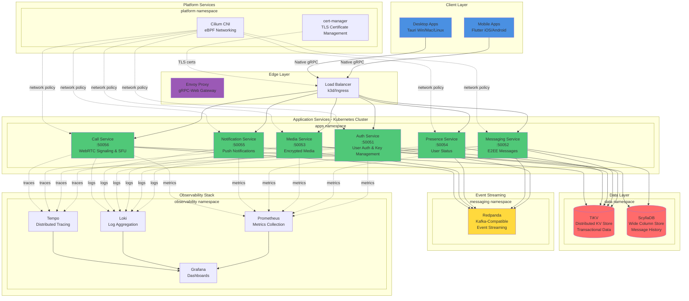
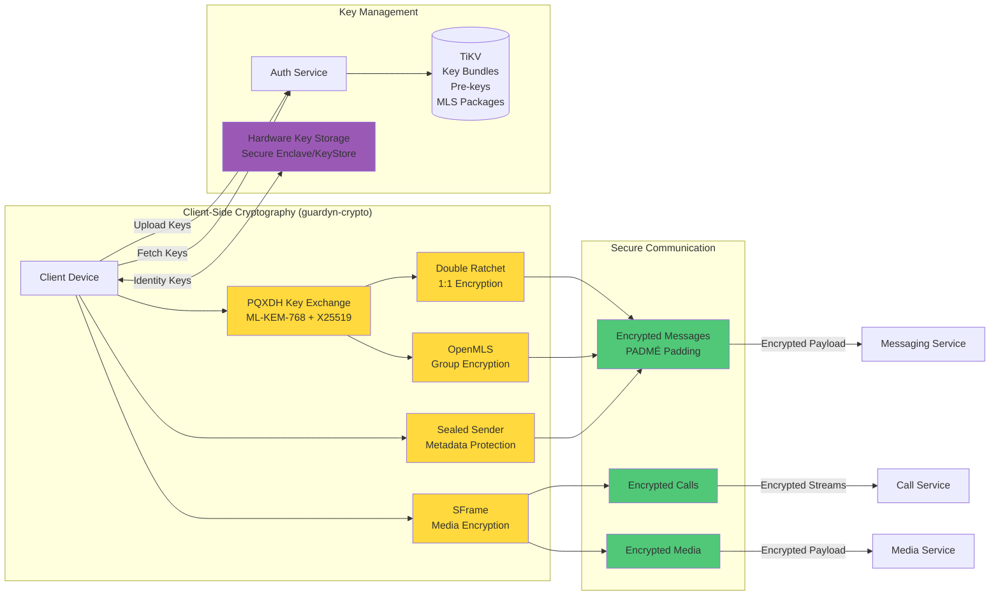
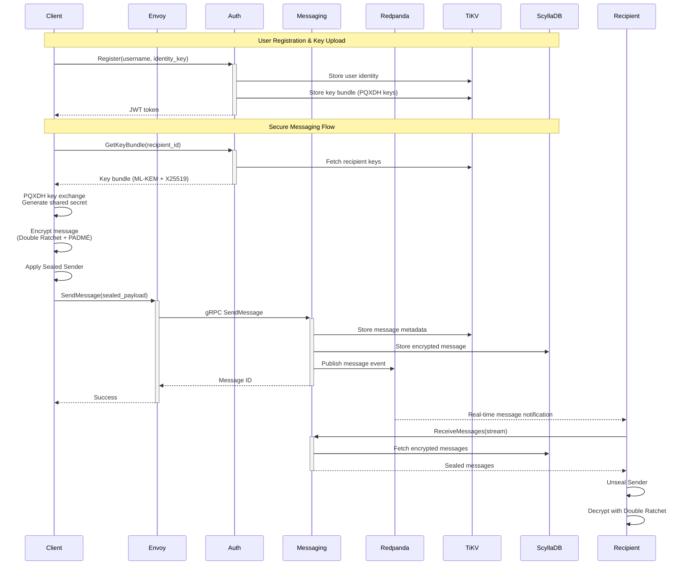
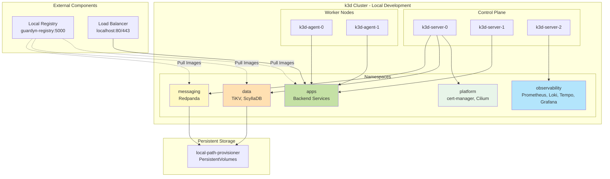
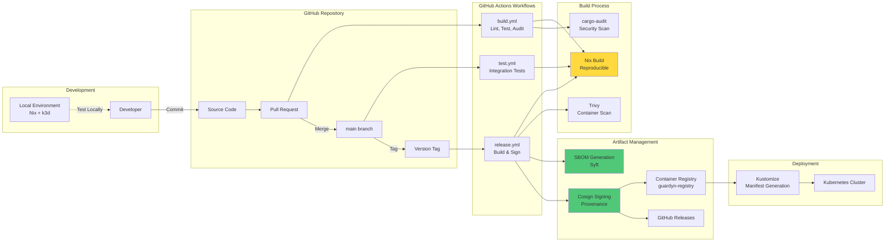
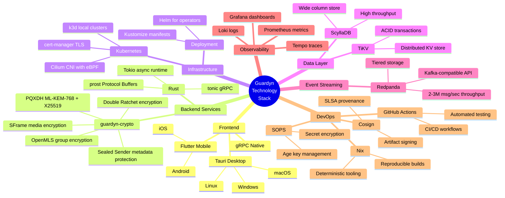
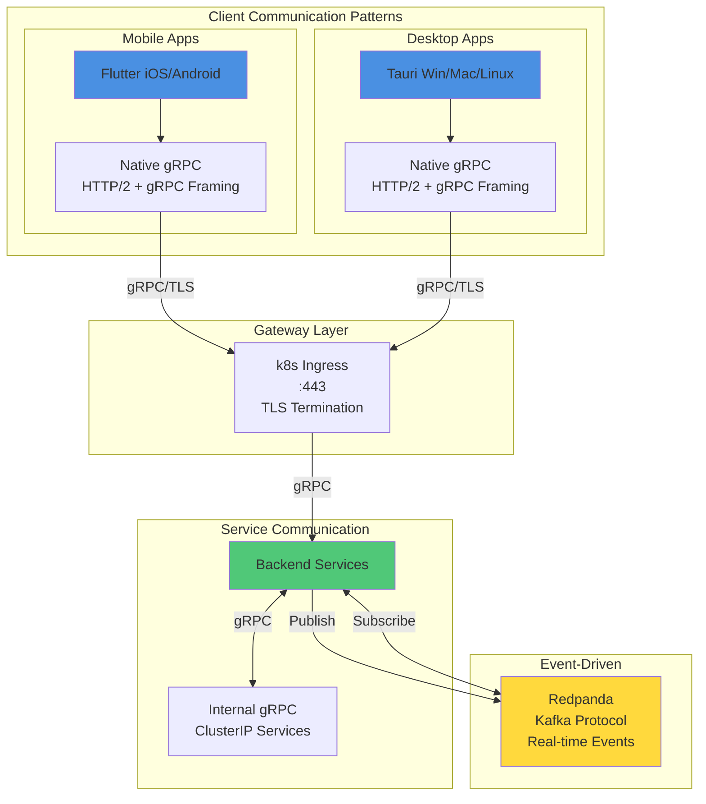

# Guardyn Architecture

This document provides a comprehensive overview of the Guardyn platform architecture using Mermaid diagrams.

## High-Level Architecture Overview

## Security Architecture

## Data Flow Architecture

## Kubernetes Deployment Architecture

## CI/CD Pipeline Architecture

## Technology Stack

## Network Communication Patterns

## Key Design Principles

1. **Privacy-First**: End-to-end encryption for all communications using PQXDH (ML-KEM-768), Double Ratchet, OpenMLS, and Sealed Sender
2. **Post-Quantum Ready**: ML-KEM-768 hybrid key exchange provides resistance against quantum computer attacks
3. **Reproducible Builds**: Nix flakes ensure deterministic builds and audit-ready artifacts
4. **Kubernetes-Native**: All infrastructure managed with Kustomize and Helm operators
5. **Domain-Agnostic**: Single `DOMAIN` variable configures all services for any deployment
6. **Observability**: Comprehensive metrics, logs, and traces via Prometheus, Loki, and Tempo
7. **Security by Design**: SOPS encryption for secrets, Cosign signing for artifacts, regular security audits
8. **Local Development Parity**: Docker Compose for fast local dev (~30s startup), k3d mirrors production topology
9. **Microservices Architecture**: Independently deployable services with clear boundaries
10. **Event-Driven Communication**: Redpanda (Kafka-compatible) for high-throughput real-time messaging
11. **Multi-Platform Support**: Flutter for mobile (iOS/Android), Tauri for desktop (Windows/macOS/Linux)
12. **Unified Cryptography**: guardyn-crypto Rust library shared across all platforms via FFI
